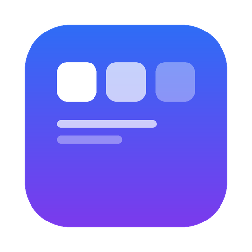

# 工作台

一个跑在你自己 Mac 上的本地工作平台。**33 个工具 + 一个能改平台自己的 AI 助手**，
全部本地运行，数据不往外传。

```
抓包看接口 · 代码日志 · iOS 开发自动化 · 崩溃符号化 · 二维码/条码 ·
接口契约 · 报文对比 · JSON / 正则 / 计算器 · 翻译表检查 · 上架材料检查 ·
截图管家 · 工程对比 · 下载夹管家 · 证书检查 · 磁盘/端口/网络诊断 …
```

## 装

**一行命令**：

```bash
curl -fsSL https://cdn.jsdelivr.net/gh/lsq0010/workbench@main/install.sh | bash
```

> 用的是 jsDelivr CDN。**别用 `raw.githubusercontent.com`** —— 国内实测连不上
> （HTTP 000）。装的时候脚本内部也会自动试好几个源下载代码包。

备选（CDN 也不通时）：

```bash
curl -fsSL https://gh-proxy.com/https://raw.githubusercontent.com/lsq0010/workbench/main/install.sh | bash
```

装完会**自动启动**，并在**桌面和启动台**留下一个带图标的「工作平台」——
双击就打开（用一个没有地址栏的窗口，看起来像个原生 App，
和 DeepSeek Harness 的桌面图标一个做法）。

<p align="center">
  
</p>

### 它做了什么

| 步骤 | 说明 |
|---|---|
| 检查环境 | macOS + Python 3.7+（macOS 自带就有）|
| 下载代码 | 从 codeload / jsDelivr / gh-proxy 挨个试，哪个通用哪个 |
| 装到 `~/工作平台` | 代码和你的数据分开，重装不会动数据 |
| 装依赖 | 缺 pillow 就 `pip install`（不装也能用，5 个画图功能会提示）|
| 建桌面图标 | `~/工作平台/工作平台.app`，以后双击启动 |
| 启动 | 自动拉起全部 33 个功能 |

### 换端口

```bash
WORKBENCH_PORT=8899 curl -fsSL .../install.sh | bash
```

### 升级

再跑一遍同一条命令就行 —— **代码会更新，你的抓包记录、日志、便签都不动**。

## 也可以 npm 装

```bash
npm install -g @lsq0010/workbench
workbench install
```

装完有个 `workbench` 命令：

```bash
workbench              # 启动并打开
workbench status       # 看状态
workbench stop         # 停掉
workbench update       # 更新（数据不动）
workbench doctor       # 体检：哪坏了、怎么修
```

## 用

双击桌面「工作平台」图标，或者浏览器打开 <http://127.0.0.1:8880/>。

**几个入口**：

- **今日关注**（桌面第一个图标，带角标）—— 各功能报上来的、需要你处理的事
  都汇总在这。点开是个左侧抽屉。
- **✦ AI 助手**（右上角，⌘I）—— 能答问题、能看截图、**能改这个平台自己的代码**。
  改之前会先读文件、说清改什么，改错了能回滚。
- **⌘K** —— 搜索所有功能
- **功能商店** —— 33 个功能，装了的不影响卸载/重装

## 手机抓包

抓包功能跑起来后，手机 Wi-Fi 代理填：

```
主机名：你 Mac 的局域网 IP（跑 ./cap status 会告诉你）
端口：  8890
```

## AI 要配 key

AI 是平台能力，**配一次所有功能都能用**：打开「设置」→「AI 配置」，
填服务商和 key，点「保存并测试」。

不想配也能用 —— 除了 AI 相关的功能，其他 30 来个工具都不依赖它。

## 数据在哪

全在 `~/工作平台/` 下，每个功能一个目录：

```
~/工作平台/
  registry.json          装了哪些功能
  desktop.json           你桌面上的图标
  identity.json          你的标识（所有功能共用）
  features/<功能>/*.jsonl  各功能的数据（只追加，不覆盖）
  backups/               AI 改代码前的备份
```

**没有云、没有账号、没有上报。** 只有你点了 AI 相关的按钮，内容才会发给你自己配的 AI 服务商。

## 卸载

```bash
~/工作平台/platform.py stop-all     # 先停掉
rm -rf ~/工作平台                    # 连数据一起删
rm -rf ~/工作平台/工作平台.app        # 桌面图标
```

想留数据就只删代码：把 `features/` 和几个 `json` 备份出来，重装后放回去。

## 环境要求

- **macOS**（部分功能用了系统自带工具：xcodebuild / Vision / plutil / sips）
- **Python 3.7+**（macOS 自带 3.9）
- 可选：`pillow`（画图相关）、`Xcode`（iOS 相关）、`git`

缺什么不影响整体 —— 用到那个功能时它会提示。

## 常见问题

**装完打不开？**
```bash
tail -30 ~/工作平台/platform.log
```

**某个功能起不来？**
```bash
cd ~/工作平台 && python3 healthcheck.py
```
它会告诉你哪个功能有问题、问题在哪。

**端口被占？**
换一个：`WORKBENCH_PORT=8899 ...`

**AI 说没配 key？**
打开「设置」→「AI 配置」。或者不用 AI —— 平台大部分功能不依赖它。

**卸载重装后，功能界面报错说找不到文件？**
那是旧安装的**残留进程**还占着端口（平台以为它在跑，就没启动新的）。
新版已经修了：停止时会按端口兜底清理。手动清一次：

```bash
# 看哪些功能进程指向了不存在的目录
for pid in $(pgrep -f "features/.*main.py"); do
  lsof -p $pid -a -d cwd -Fn 2>/dev/null | grep "^n" | cut -c2-
done
```

---

## 给开发者

```
files/            装到 ~/工作平台 的东西
  platform.py     平台主程序（注册、桌面、聚合、AI 根入口）
  lib/            AI 根入口 + 值守
  web/            桌面界面
  store/          33 个功能的源码
install.sh        安装脚本
```

**加一个功能**：在 `files/store/` 下建个目录，放 `manifest.json` + `main.py` + `index.html`，
manifest 里声明端口和权限（`why` / `risk` / `mitigation` 三个都要写）。
平台会自动发现。

**功能之间只通过 HTTP 接口通信**，不互相读文件。
